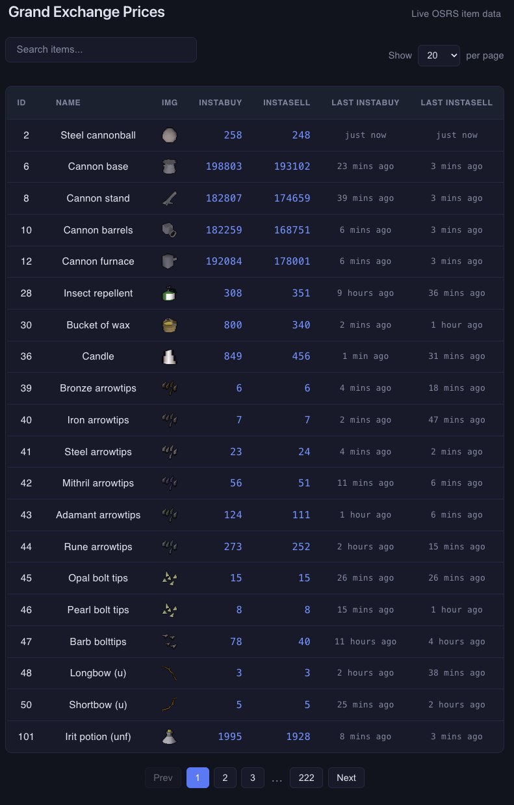

# Grand Exchange Trading Application

A full-stack price-tracking application for Old School RuneScape's Grand
Exchange, built on the OSRS Wiki's real-time pricing API. A scheduled
background job continuously ingests live price data into PostgreSQL, and a
React frontend provides searchable, paginated access to it.

## Features

- **Live price ingestion** — a scheduled background job polls the OSRS Wiki
  API every 10 minutes and upserts current buy/sell prices for all ~4,450
  tradeable items
- **Search** — case-insensitive, partial-match search by item name, handled
  server-side via SQL `ILIKE`
- **Pagination** — configurable page size (20/50/100), with page-number
  navigation and total-result counts
- **Relative timestamps** — "5 mins ago" / "2 hours ago" style display for
  last trade times
- **Fully containerised** — one command (`docker-compose up`) brings up the
  API, database, and background poller together

## Currently Working On

- **Batch Inserts** - Currently takes 5 minutes for each insert into database, will optimise this to fix congestion issues

## Future Features

- Historical price charts (a time-series table exists in the schema but
  isn't yet populated or exposed via the API)
- Live UI updates — the frontend reflects data as of the last page load,
  not the last poll (a manual refresh shows current data)

## Screenshot



## Architecture

```
                Internet
                    |
                    v
      +--------------------------+
      |   OSRS Wiki Prices API   |
      |  /latest    /mapping     |
      +-------------+------------+
                    |
                    | polled every 60s (APScheduler)
                    v
      +--------------------------+
      |   FastAPI Application    |
      |                          |
      |  Scheduled ingestion job |
      |  - fetch latest prices   |
      |  - resolve item names/   |
      |    icons                 |
      |  - upsert into Postgres  |
      |                          |
      |  REST API                |
      |  - GET /api/prices/latest|
      |    (search, pagination)  |
      +-------------+------------+
                    |
                    | SQLAlchemy (async) / asyncpg
                    v
      +--------------------------+
      |      PostgreSQL          |
      |  items                   |
      |  item_time_stamp         |
      +--------------------------+
                    ^
                    | REST (JSON)
                    |
      +--------------------------+
      |   React (Vite) Frontend  |
      |  - searchable, paginated |
      |    item table            |
      +--------------------------+
```

## Tech stack

| Layer | Technology |
|---|---|
| Backend | Python 3.11, FastAPI, Uvicorn |
| ORM | SQLAlchemy 2.0 (async), asyncpg |
| Database | PostgreSQL 15 |
| Scheduling | APScheduler (`AsyncIOScheduler`) |
| Frontend | React, Vite |
| Dependency management | uv |
| Containerisation | Docker, Docker Compose |

## Getting started

### Prerequisites

- Docker Desktop
- Node.js (for running the frontend dev server)
- A `.env` file (see below) — the app won't start without one, since the
  OSRS Wiki API requires a descriptive `User-Agent` on every request

### Backend

```bash
git clone https://github.com/vondevnz/grand-exchange-trading-app.git
cd grand-exchange-trading-app
cp .env.example .env
# edit .env and set USER_AGENT_TEXT to identify your own instance
docker-compose up --build
```

This starts:
- a PostgreSQL container (`db`)
- the FastAPI app (`app`) on `http://localhost:8000`

On startup, the app creates any missing database tables and starts the
scheduled polling job automatically — no manual data-loading step required.
Prices begin populating within the first polling interval.

Interactive API docs are available at `http://localhost:8000/docs`.

### Frontend

```bash
cd frontend
npm install
npm run dev
```

Runs on `http://localhost:5173` by default (Vite's dev server), and talks to
the backend at `http://localhost:8000`.

## API

### `GET /api/prices/latest`

Returns a paginated, optionally filtered list of items with current prices.

**Query parameters**

| Param | Type | Default | Description |
|---|---|---|---|
| `page` | int | `1` | Page number |
| `page_size` | int | `20` | Items per page (20 / 50 / 100) |
| `search` | string | — | Case-insensitive partial match on item name |

**Example response**

```json
{
  "items": [
    {
      "item_id": 4151,
      "name": "Abyssal whip",
      "item_image": "https://oldschool.runescape.wiki/images/Abyssal_whip.png",
      "instabuy": 2750000,
      "instasell": 2700000,
      "last_instabuy_time": "2026-07-15T09:59:52+00:00",
      "last_instasell_time": "2026-07-15T10:26:37+00:00"
    }
  ],
  "total": 4452,
  "page": 1,
  "page_size": 20,
  "total_pages": 223
}
```

## Design decisions

**Upsert over insert-then-update.** Price ingestion uses a single atomic
`INSERT ... ON CONFLICT DO UPDATE` statement per item rather than a
check-then-branch pattern, avoiding an extra round-trip and a race condition
between concurrent writes.

**Backend-driven search and pagination.** With ~4,450 items, returning the
full dataset to the client on every request isn't practical. Filtering and
paging happen in SQL, so the client only ever receives the data it needs to
render.

**Debounced client-side search.** The frontend waits for a pause in typing
before issuing a request, rather than firing one on every keystroke —
reducing redundant network calls and avoiding out-of-order response races.

**Defensive data handling.** The OSRS Wiki API occasionally omits fields
for a small number of items (missing price data, missing icon mappings,
missing name mappings). Rather than allowing these to crash the ingestion
job, affected items are skipped for that polling cycle rather than inserted
with invalid or partial data.

## License

MIT